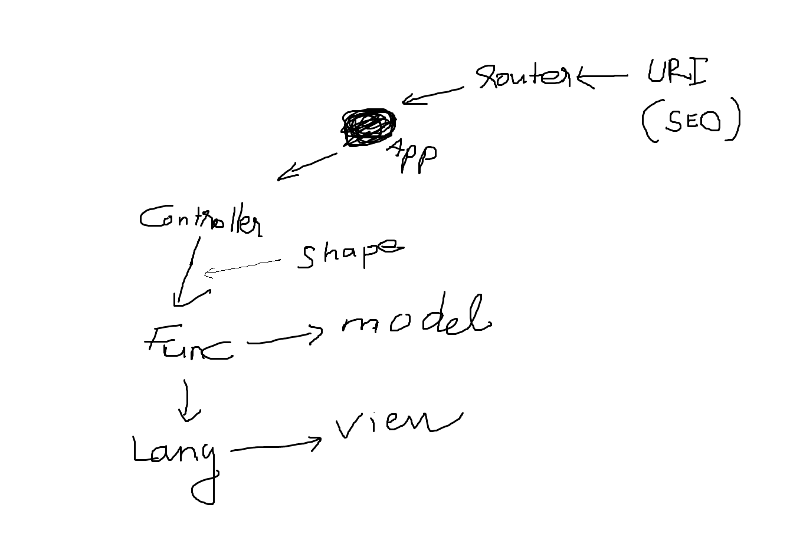

# Luồng dữ liệu

- Độ khó: Cơ bản
- Bắt buộc: Cao

-------


*Chào mừng quay trở lại ! Đã đi đến phần này thì chắc bạn cũng bạn hiểu được phần trọng tâm của Ducky rồi. Tiếp theo chúng ta sẽ tìm hiểu về luồng dữ liệu.*




*Hình: Luồng dữ liệu của Ducky phiên bản 0.1.1*


## Bắt đầu từ URI

Đầu tiên bạn phải phân biệt được URI và URL đã.

- URL: Là đường dẫn sau khi đã SEO. 
- URI: Là đường dẫn thô thiển xấu xa nhất, chứa các thông tin để phản hồi request.

Cả 2 đều phải duy nhất và tuân theo quy tắc riêng. Bạn có thể đọc lại bài viết về URI **[ở đây](/begin/ducky-uri)**.

Khi Ducky nhận được 1 request, nó sẽ dựa theo cấu hình Route (URL Friendly) để tìm ra URI thật sự của request. Sau đó, URI sẽ được đưa vào lớp `Route` để phân tích.

Nếu xét về thứ tự gọi và nhúng tệp, thì tất cả request sẽ được chuyển về tệp `index.php` để xử lý. Từ tệp `index.php`, sẽ gọi hàm `run()` của tệp `App.class.php`, lớp `App` sẽ điều khiển toàn bộ quá trình sau đó. Bao gồm dùng `controller` nào, `model` và `view` nào, dịch ngôn ngữ ra sao.

Chính vì vậy, trên hình, `App` được xem là trung tâm xử lý.

```php
<?php 
  
  // index.php
  $app = new App($_SERVER['REQUEST_URI']);
?>
```


## `App` gọi `controller`

Như đã nói ở trên, `App` sẽ là trung tâm xử lý. Như vậy:

- Nó sẽ lưu tất cả các thuộc tính cần dùng cho ứng dụng vào đối tượng `App`. Ví dụ sau này trong lúc code, bạn muốn lấy `$language` thì hãy dùng như sau nhé: `App::_getLanguage()`.
- Các thuộc tính của `App` có thể được dùng ở bất cứ đâu.

Sâu hơn nữa về `App` tôi đã trình bày rất rõ ràng **[ở đây](/class/system/app)**.

Sau khi phân tích xong URI, `App` sẽ dùng segment `controller` trong URI để khởi tạo `Controller` tương ứng, sau đó gọi đến hàm tương ứng với segment `controller_function` nằm trong `Controller` vừa khởi tạo.

``` php
<?php 
  
  // App.class.php
  class App
  {
     
  	// Hàm run
    public function run($uri)
    {
      
      //Khởi tạo lớp Route & phân tích URI
      $router = new Route();
      $router -> parse($uri);
			
      //Lấy nội dung tương ứng với request
      $controller = $router -> _getController();
      $controllerFunc = $router -> _getControllerFunc();
      $controllerObj = new $controller();
      
      //Gọi hàm nằm trong controller, trả về $contents
      $contents = $controllerObj -> $controllerFunc(); 
	}
  }
?>
```


## `controllerFunc()` gọi `Model` và  `View`

Hàm này sẽ tiến hành gọi đến `Model` tương ứng với segment `model`. `Model` này sẽ thao tác với cơ sở dữ liệu. Sau đó, nhờ sự hỗ trợ của Template Engine (`Shape`), nội dung trả về sẽ được ghép vào khuôn HTML.

```php
<?php 
  
  // App.class.php
  class App
  {
     
  	// Hàm run
    public function run($uri)
    {
      
      //Khởi tạo lớp Route & phân tích URI
      $router = new Route();
      $router -> parse($uri);
			
      //Lấy nội dung tương ứng với request
      $shape = $router -> _getShape();
      $controller = $router -> _getController();
      $controllerFunc = $router -> _getControllerFunc();
      $controllerObj = new $controller();
      
      //Gọi hàm nằm trong controller, hàm này sẽ assign nội dung của view vào lớp View
      $controllerObj -> $controllerFunc(); 
			
      //Load view
      $view = new View();
      $html = $view -> render($shape, $controller, $controllerFunc);
    }
  }
?>
```


## Đa ngôn ngữ

Trước khi trả về nội dung cuối cùng, Ducky sẽ chạy lớp `Language` để dịch sang ngôn ngữ tương ứng với segment `language` của URI.

```php
<?php 
  
  // App.class.php
  class App
  {
     
  	// Hàm run
    public function run($uri)
    {
      
      //Khởi tạo lớp Route & phân tích URI
      $router = new Route();
      $router -> parse($uri);
			
      //Lấy nội dung tương ứng với request
      $shape = $router -> _getShape();
      $controller = $router -> _getController();
      $controllerFunc = $router -> _getControllerFunc();
      $controllerObj = new $controller();
      
      //Gọi hàm nằm trong controller, hàm này sẽ assign nội dung của view vào lớp View
      $controllerObj -> $controllerFunc(); 
			
      //Load view
      $view = new View();
      $html = $view -> render($shape, $controller, $controllerFunc);
      
      //Gán html vào lớp Language
      $language -> setHtml($html);
      
      //In html ra trình duyệt
      $language -> show();
      
    }
  }
?>
```


## Tối ưu

Sau khi dịch hoàn tất, ở công đoạn cuối cùng, Ducky sẽ minify tệp `html` trả về. Tệp này cũng được `cache` (nếu cần) ở công đoạn này.


----------

Viết ngày: 29/09/2017

Chỉnh sửa lần cuối vào: 01/10/2017