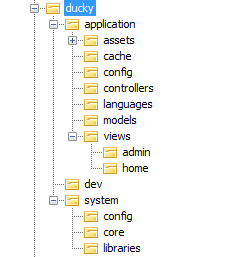

# Cấu trúc thư mục

- **Cấp độ:** Cơ bản
- **Bắt buộc:** Rất cao

----------

*Chào mừng quay trở lại với thế giới vịt :p*

*Ở bài viết này, chúng ta sẽ cùng tìm hiểu về cấu trúc thư mục của Ducky.*

***Một nguyên tắc:*** Tuyệt đối không tạo tệp và thư mục lung tung. Vịt không thích điều này.

## Tổng quan

*Hình: Cấu trúc thư mục của bộ source Ducky chuẩn (dành cho Dev core)*

Các thư mục trong hình trên được giải thích ở bảng dưới đây:

| Tên thư mục      | Chức năng                               | Phần mở rộng tên tệp     |
|------------------|-----------------------------------------|--------------------------|
| **application**  | Chứa các tệp của ứng dụng               | -                        |
| ../assets        | Chứa các tệp css, js, hình ảnh          |\*.js,\*.css,\*.png,\*.jpg|
| ../cache         | Chứa các tệp phục vụ caching            | -                        |
| ../config        | Chứa các tệp thiết lập của ứng dụng     | *.conf.php               |
| ../controllers   | Chứa các tệp điều khiển                 | *.controller.php         |
| ../languages     | Chứa các tệp ngôn ngữ                   | *.language.php           |
| ../models        | Chứa các tệp tương tác với Database     | *.model.php              |
| ../views         | Chứa các tệp html                       | *.view.php               |
| ../../home       | Chứa các tệp của shape `home`           | *.view.php               |
| ../../admin      | Chứa các tệp của shape `admin`          | *.view.php               |
| **system**       | Chứa các tệp của hệ thống               | -                        |
| ../config        | Chứa các tệp thiết lập của hệ thống     | *.conf.php               |
| ../core          | Chứa các lớp quan trọng nhất của Ducky  | *.class.php              |
| ../libraries     | Chứa các tệp thư viện                   | *.lib.php                |

## Các lưu ý

**Không chỉnh sửa các tệp trong thư mục `system`**

Thư mục `system` là thư mục hệ thống của Ducky, chứa các lớp và thư viện điều khiển quan trọng, đặc biệt là các lớp:

- Lớp [View](/class/system/view): Điều khiển Template Engine
- Lớp [App](/class/system/app): Điều khiển việc chạy ứng dụng
- Lớp [Route](/class/system/route): Điều khiển URL

Việc chỉnh sửa các tệp này cần được làm bởi người thông hiểu Ducky và có trách nhiệm phát triển framework cho nhóm.

**Đừng nhầm lẫn thư mục `config` của hệ thống và của ứng dụng**

Thư mục `config` có cả trong thư mục `application` và thư mục `system`. Mặc dù đều chứa tệp thiết lập nhưng lại có ý nghĩa khác nhau:

- `application/config`: Các tệp trong thư mục này lưu các thiết lập do **người dùng** tạo ra. Người dùng ở đây chính là coder có trách nhiệm phát triển ứng dụng.
- `system/config`: Các tệp trong thư mục này lưu các thiết lập **mặc định** của Ducky, các thiết lập này được cài sẵn và chỉ thay đổi khi Ducky đưa ra phiên bản mới.

**Tên tệp luôn là tên lớp**

Ở các thư mục như `controllers`, `models`, `core` thì tên tệp luôn là tên lớp.

Ví dụ:

- Tệp `login.controller.php` sẽ chứa lớp `LoginController`
- Tệp `login.model.php` sẽ chứa lớp `LoginModel`
- Tệp `View.class.php` sẽ chứa lớp `View`

**Không tự thêm thư mục**

Cấu trúc thư mục được thiết kế là phù hợp nhất đối với các yêu cầu của Ducky. Và sẽ ảnh hưởng đến thuật toán nâng cấp về sau. Cho nên không tự thêm dù chỉ là 1 thư mục. Tôi tin rằng, các thư mục hiện tại sẽ đủ chỗ cho tệp *"my-super-file.php"* nào đó của bạn.

----------
Ngày viết: 29/09/2017
